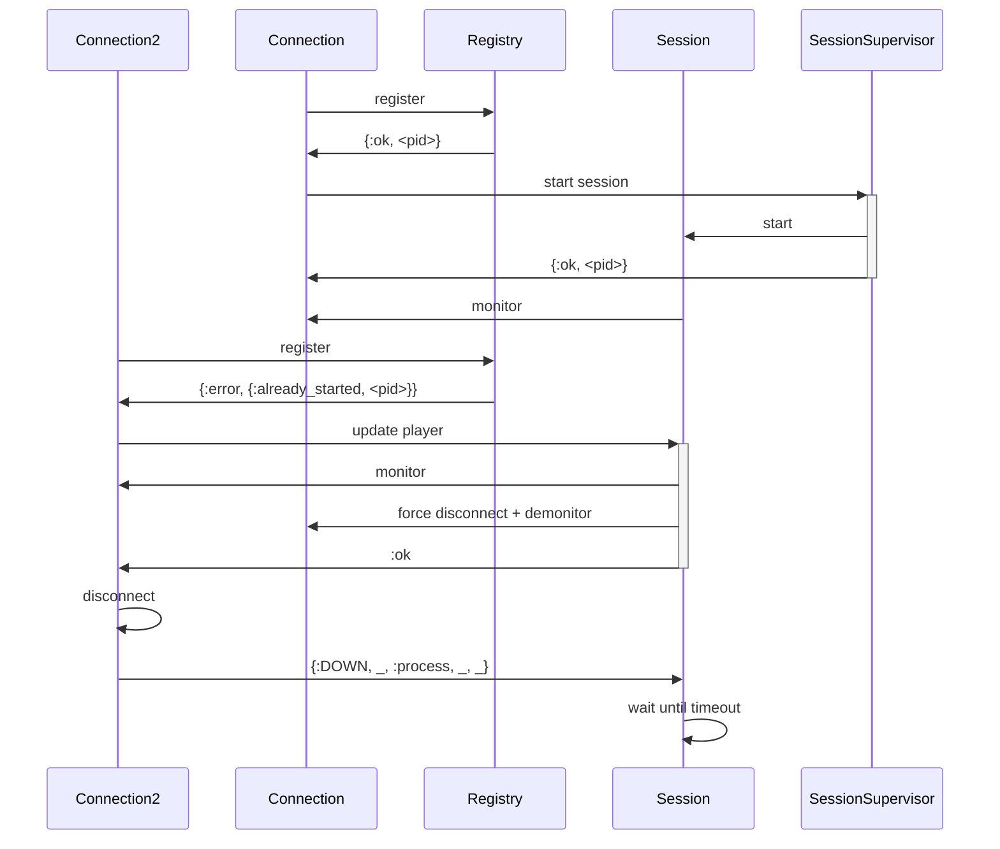
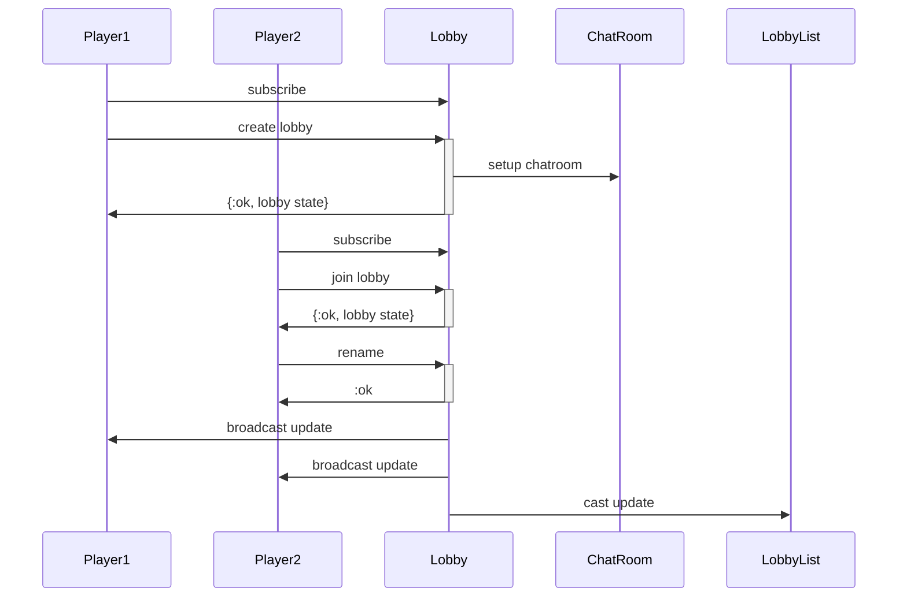
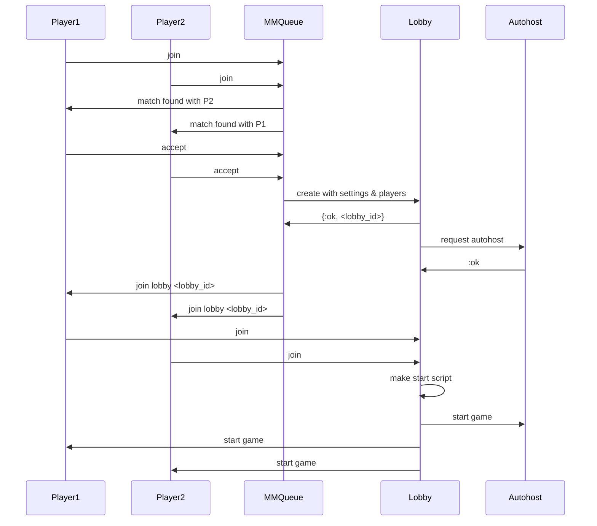
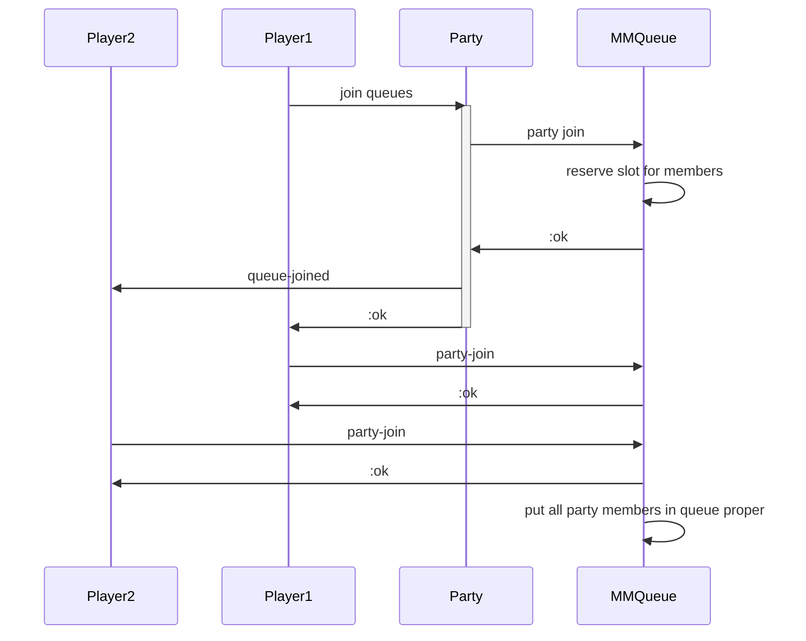

# tachyon system

This is a high level architecture design of tachyon implementation.

## Goals

* Support up to 100k concurrent users. This is the target we're aiming for steam.
* Support adding and removing nodes to the cluster to adapt to load.
* Support player reconnection. A player that loses connection and reconnect
  within a small window of time shouldn't be impacted: keep its place in any
  matchmaking queue or lobby.
* Support seamless server restart: lobbies, matchmaking queues, chat and so on
  shouldn't be impacted when a server (maybe the only one) restarts.
  This is only for graceful shutdown of nodes. Supporting these features
  for sudden crash is a stretch goal.

Tachyon is a hard requirement for the scaling goal. The other could be done
with existing spring lobby protocol, but supporting tachyon requires significant
changes to existing components so we might as well aim for all of them.

## Player and connection

A player connects to teiserver following the [tachyon doc](https://github.com/beyond-all-reason/tachyon/blob/master/docs/connection.md).

Entities:

* `PlayerConnection`: this is the process handling the http connection then upgraded
  to websocket. It holds the transient state of a player like lobby membership.
* `PlayerSessionSupervisor`: supervisor for `PlayerSession`
* `PlayerSession`: A separate process, unique per player across the cluster.
  Used to track if a given player is actually connected. Shouldn't hold much state.
* `PlayerRegistry`: Global registry for players. Similar to the existing
  `Teiserver.ClientRegistry` in purpose. May be able to reuse that directly.

Example of an interaction where the same player connects, then connects again.

## Autohosts

Autohosts connects to the server and are ready to be summoned to host a game by a lobby.
Maybe expand tachyon so that they can provide some info about themselves, like region, engine version?

Later, we can expand the autohost system to have some form of capacity scheduling.

## Chatrooms
Separate processes dedicated to relay messages across a list of recipients (player or autohost).
Each process has a ring buffer of recent messages to allow replaying messages in case a player
reconnects after crash.

## Lobbies

Process responsible to setup the game and mediating player interactions (except chat).
It should also select a free autohost to launch the game once ready.

Entities:
* Lobby: process that holds:
  * the lobby name and restrictions
  * a list of player with their team membership/spectator
  * a queue of waiting players
  * player statuses like boss
  * votes
  * game settings like map, tweaks and so on.

  Lobbies should keep an internal counter of broadcasted event so that subscribed
  players can detect if they missed one and request the lobby state again.

* LobbyList: manage list of lobbies, holding information for searching and filtering.
  May be in memory process (potentially partitionned) or just saving to the DB.

### Disconnection and leaving a lobby

Lobbies monitor the player session process to check if they are still connected.
When that process dies, the player should be removed from the lobby.

## Matchmaking, player and lobby interactions

Matchmaking can be done using the approach described in [the matchmaking dev guide](./matchmaking.md).
A matchmaking queue is a process, global across the cluster, spawned at startup.
For MVP the queue is a single process, but this could be partitionned by buckets later.
For MVP, the queues will be hardcoded, but that could be DB driven in the future.

Entities:
* P1, P2: PlayerConnections process directly handling tachyon commands.
* MMQueue: one of the matchmaking queue process.
* Lobby: a lobby process. Handle player list, bosses, votes, bosses, game settings like map, ranked?, tweaks.
* Autohost: represent a pool of connected autohost ready to host a game.

If a player fail to answer a ready request within a timeout, that player is
evicted from the queue, and all other players are put back where they were.

## Matchmaking with parties

This requires coordinating all the party members so that they all join the
queues.

`P1` and `P2` are both member of `Party`. When a player joins matchmaking,
the party reserves a slot for all the required queues, then get locked:
all pending invites are cancelled.
This drastically simplify the state of the party.
The party has the responsability to let all members know they should join
the slot. Once all members joined the slot, they are considered in the queue
and will be elligible for pairing.

## Listings

We need a way to list online players + some info, as well as the lobbies. This
should also support some kind of filtering.

For example:
* show me all public lobbies from 4v4 and up, with no OS restriction and 1 min chevron.
* show me all my friends and their status (playing in game, spectating, chilling, in lobby)

This part is the most speculative as of yet. There are basically 3 options:

1) store this data in the DB and query it through SQL.
  * pros: queries are simple and well understood.
  * cons: put a limit on scaling based on write capacity of the DB. Need to deal with stale data.

2) store the data in globally unique processes (ETS backed)
  * pros: simple to implement. No stale data problem (can monitor when entities go away)
  * cons: potentially requires a lot of memory. Querying may be slow. Single bottleneck.

3) distribute the data across all nodes in their own ETS tables.
  * pros: scale well. Fairly easy to deal with stale data
  * cons: querying is a lot more complex, it's more akin to map/reduce.

For option 3:

* One local process per node receives updates of local process to update the ETS table of the node.
  The writer process may be partitionned for throughput.

* Players broadcast relevant updates to the local node's writer(s).
* The writer creates/updates local ETS store with the data.
* The writer also monitor the player's session to clear up the ETS store when it goes away.

* Querying process call a dedicated query process (can potentially use [poolboy](https://github.com/devinus/poolboy)).
* Dedicated query process uses [Genserver.multi_call/4](https://hexdocs.pm/elixir/GenServer.html#multi_call/4)
  to query other dedicated query process on the other nodes + query its own ETS table.
* Dedicated query process gather data and respond.
* There should be different pool of processes to answer query from local process vs responding
  to query from other nodes to avoid any deadlocks.

